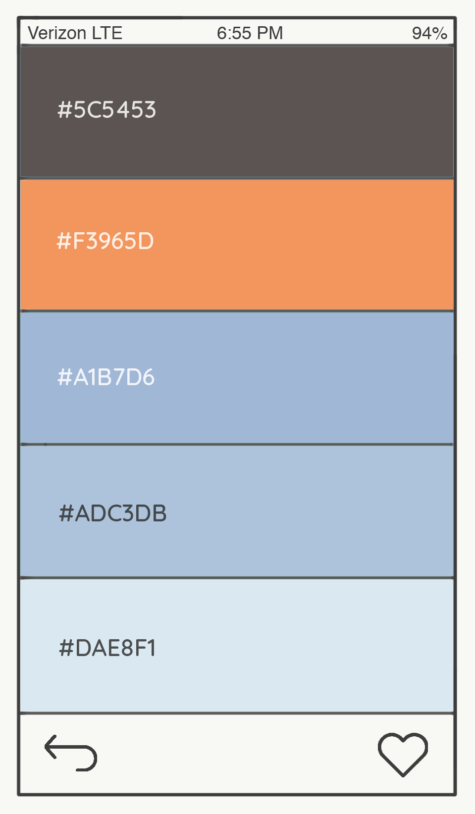

# Project 4

### Screenshots of the App
        

### App Description
Palettable is a mobile app that allows users to discover and generate beautiful color palettes. Users can explore pre-made color palettes on the 'Discover' page, as well as create their own color palettes by uploading or taking a picture of their surroundings on the 'Generate' page. Palettable utilizes the phone's built-in camera to capture and extract the prominent colors from an image to create unique color palettes.

---

## Explanations of the Technologies Used
- React Native — a framework for building native mobile apps
- Xcode — a software development environment that allows you to simulate your app on an iPhone
- ColorLovers API — color palette API that allows you to randomly generate a color palette and get color suggestions
- Clarifai Predict Color API - an that extracts prominent colors from an image
- `react-native-image-picker` - a React Native module that allows you to use native UI to select a photo/video from the device library or directly from the camera
- `react-native-navigation` - a React Native navigation module (nav bars, tab bars, side menu drawers)
- `hex-to-rgb` — converts hex values to rgb
- Firebase Authentication — Firebase Auth offers multiple methods to authenticate, including email and password, third-party providers like Google or Facebook, and using your existing account system directly
- Firebase Realtime Database — Store and sync data between users and devices in realtime using a cloud-hosted, NoSQL database
- `native-base` — a free and open source UI component library for React Native
- `react-native-fetch-blob` — a data transfer package for React Native
- `array-has-duplicates` — checks if an array includes duplicated values or not

## Installation Instructions for Dependencies
Run `yarn install` to install all of the app's dependencies from the `package.json` file.

---

## User Stories:
- As a web developer, I want to easily discover a wide variety of color palettes, so I can design my website with colors that I know look good together.
- As an interior designer, I want access to lots of color palettes, so I can choose from a lot of options when designing my clients' homes.
- As a smartphone user, I want to be able to take a photo of something that has nice colors, so I can find out exactly what colors they are.

---

## Wireframes
     

---

## Unsolved Problems or Hurdles
I had a lot of difficulties with navigating throughout the app. Initially I had a set up where the app would start with a main menu screen with links to the other components (like in my wireframes), but had a hard time hiding/revealing the nav bar. I decided that having the nav bar was more important, so I got rid of the main menu screen, and the app starts on the login/register page instead.

I also wanted to be able to redirect the user to a specific screen after logging in, registering, or logging out, but wasn't able to do that by the deadline.
