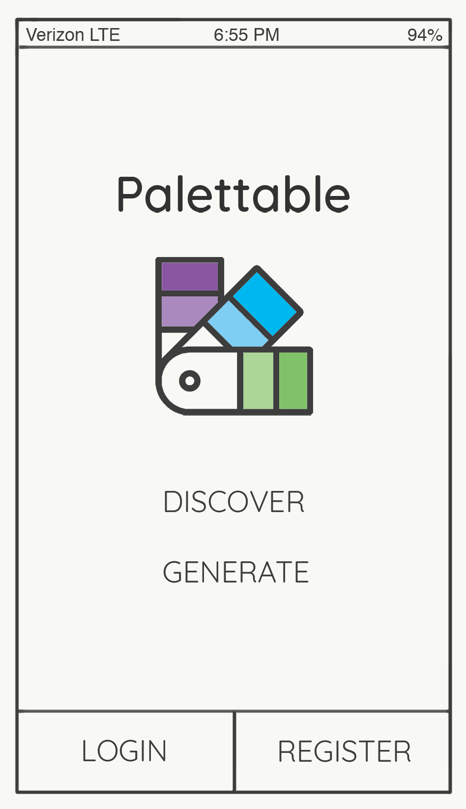

# Project 4

### Screenshot of the app

### General Approach

---

## Explanations of the technologies used
- React Native — a framework for building native mobile apps
- Xcode — a software development environment that allows you to simulate your app on an iPhone
- COLOURlovers API — color palette API, used to randomly generate a color palette on the discover page
- `hex-rgb`/`rgb-hex` — converts hex to rgb or rgb to hex
- `react-native-navigation` - React Native navigation (nav bars, tab bars, side menu drawers)
- `react-native-image-picker` - a React Native library which extracts prominent colors from an image

## Installation instructions for dependencies

---

## User stories:

---

## Wireframes
     

---

## Unsolved problems or hurdles
